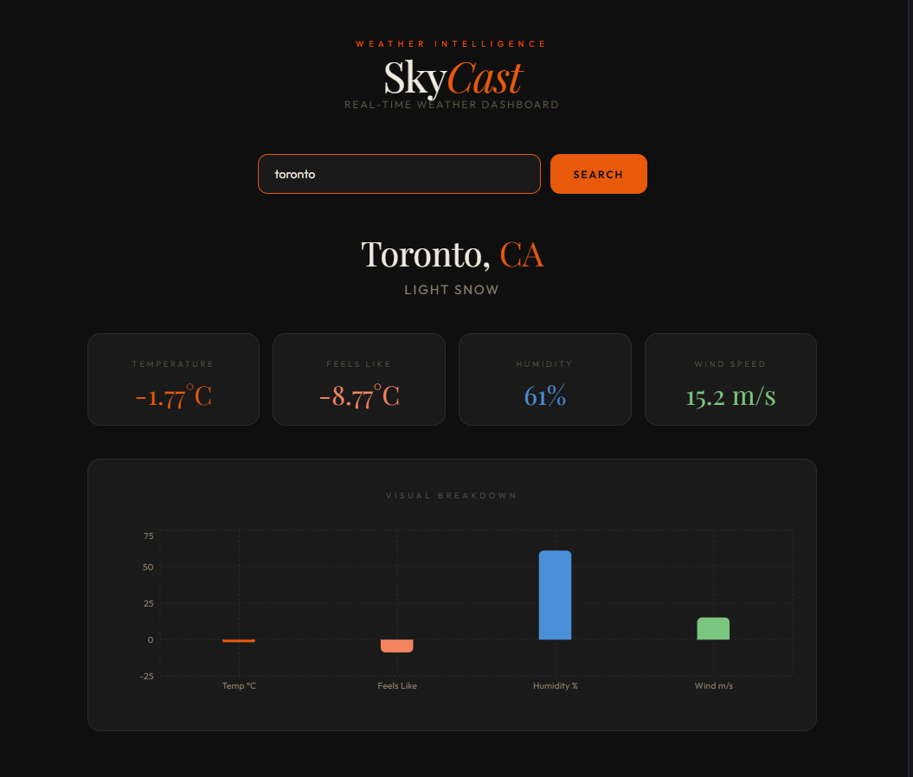

# SkyCast — Weather REST API

A REST API that fetches real-time weather data for any city using the OpenWeatherMap API. Built with Flask and Python.

<p align="center">
  
</p>

## What it does

- Accept a city name as a query parameter
- Fetch live weather data from OpenWeatherMap
- Return clean, structured JSON response
- Handles errors for invalid city names

## Tech Stack

- Python 3
- Flask — REST API framework
- OpenWeatherMap API — weather data source
- Requests — HTTP calls to external API

## Running Locally
```bash
python -m venv venv
venv\Scripts\activate
pip install flask requests
python app.py
```

## API Usage

**GET** `/weather?city=Lagos`
```json
{
  "city": "Lagos",
  "country": "NG",
  "temperature": 28.1,
  "feels_like": 32.19,
  "condition": "Scattered clouds",
  "humidity": 79,
  "wind_speed": 3.76
}
```

## Key Concepts

- **REST API design** — clean endpoints, proper HTTP status codes
- **Query parameters** — `request.args.get()` to receive input
- **External API integration** — calling OpenWeatherMap and processing JSON
- **Error handling** — returns 400 for missing city, 404 for invalid city

## Author

**Omobolanle Sadela**  
[GitHub](https://github.com/bolanlesadela) · [LinkedIn](https://www.linkedin.com/in/omobolanle-sadela-7a486a1b4/)
